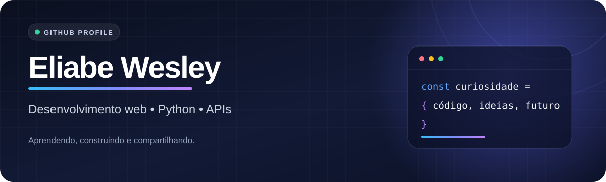

<p align="center">
  
</p>

<p align="center">
  <a href="https://www.linkedin.com/in/eliabe-wesley/"></a>
  <a href="https://www.instagram.com/weliabe/"></a>
  <a href="https://github.com/eliabeW?tab=repositories"></a>
</p>

<p align="center">
  <a href="#-em-poucas-palavras">Sobre</a> &nbsp;•&nbsp;
  <a href="#-projetos-em-destaque">Projetos</a> &nbsp;•&nbsp;
  <a href="#-meu-kit-de-ferramentas">Tecnologias</a> &nbsp;•&nbsp;
  <a href="#-github-em-números">Estatísticas</a>
</p>

---

## 👋 Em poucas palavras

Sou **Eliabe Wesley**. Gosto de aprender construindo e de transformar conceitos técnicos em projetos e anotações úteis. Neste perfil você encontra exercícios de Python, estudos de Git e GitHub, material sobre APIs REST e experimentos com desenvolvimento web.

```text
💻  Interfaces web e programação
🐍  Estudos e exercícios em Python
🔗  Integração entre aplicações e APIs
📚  Conhecimento compartilhado em repositórios
```

## 🚀 Projetos em destaque

| Projeto | Visão rápida | Acesso |
| :--- | :--- | :--- |
| **Curso em Vídeo · Python** | Exercícios de Python do Curso em Vídeo. | [Explorar →](https://github.com/eliabeW/CursoemVideo-Python) |
| **Curso em Vídeo · Git e GitHub** | Aulas e desafios sobre controle de versão. | [Explorar →](https://github.com/eliabeW/CursoemVideo-Git-Github) |
| **Resumo sobre APIs REST** | Notas sobre REST, métodos HTTP e códigos de resposta. | [Ler →](https://github.com/eliabeW/resumoApiREST) |

<p align="center"><a href="https://github.com/eliabeW?tab=repositories"><strong>Veja todos os meus repositórios →</strong></a></p>

## 🧰 Meu kit de ferramentas

| Área | Tecnologias |
| :--- | :--- |
| **Interfaces** | HTML5 · CSS3 · JavaScript · React |
| **Programação** | Python |
| **Fluxo de trabalho** | Git · GitHub |

<p align="center">
  
  
  
  
  
  
</p>

## 📊 GitHub em números

<p align="center">
  <a href="https://github.com/eliabeW?tab=followers"></a>
  <a href="https://github.com/eliabeW?tab=repositories"></a>
</p>

<p align="center">
  <a href="https://github.com/eliabeW"></a>
  <a href="https://github.com/eliabeW#js-contribution-activity"></a>
</p>

<p align="center">
  <a href="https://github.com/eliabeW#js-contribution-activity">Ver contribuições no GitHub</a> &nbsp;•&nbsp;
  <a href="https://github.com/eliabeW?tab=repositories">Ver repositórios</a>
</p>

<sub>Os cartões externos podem ter atraso na atualização. Os links acima levam aos dados do próprio GitHub.</sub>

---

<p align="center"><em>“Explorar as fronteiras da tecnologia é como abrir as páginas de um livro infinito — sempre há algo novo para descobrir.”</em></p>

<p align="center">Gostou de algum projeto? <a href="https://www.linkedin.com/in/eliabe-wesley/">Vamos conversar no LinkedIn.</a></p>
